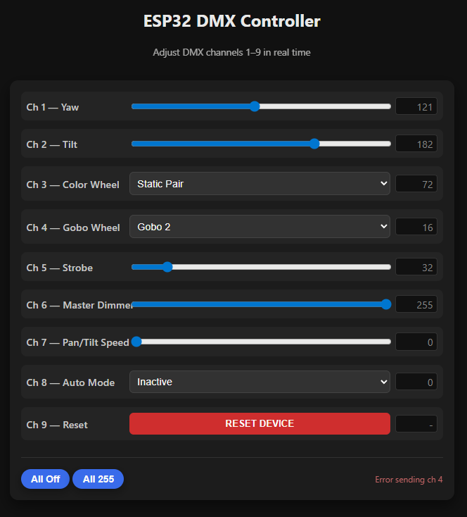

# ESP32 DMX Controller

### Overview

This project aims to use a basic ESP32 board to control multiple DMX lighting fixtures wirelessly through a web interface, a la WLED, for less than $15 in parts (**Figure 1**).  Here, I use a moving head fixture for proof of concept (**Figure 2**).

- DMX uses a differential signaling method over RS485, so a MAX485 module is used to convert signals from the ESP32's UART pins to DMX-compatible signals (**Figure 3a**)

- These signals connect to a DMX fixture via a standard 3-pin XLR cable (**Figure 3b**)

- In addition to handling the DMX signal encoding, the ESP32 hosts a simple web interface written in HTML/CSS/JS that allows the user to control DMX signal sends over WiFi from a mobile device or computer (**Figure 4**)

---

### **Fig. 1:** Overview Scheme

---

### **Fig. 2:** Proof of concept

---

### **Fig. 3:** Initial circuit, soldering, & wiring

- *Note that Youtuber Gadget Reboot seemed to experience no difficulties bitbanging his Arduino's GPIO pins directly into the MAX485 without a UART like the ESP32 has, but presumably that method would prove less consistent in a project where the CPU was having to deal with WiFi components or otherwise deviating from the strict timing requirements of DMX and using more complex fixtures like moving heads where imprecise timings may result in more obvious jerky motion.*

- *Also note that the original ChatGPT sketch used the D4 GPIO pin to selectively pull the TX/RX pins high for control over transmission direction, but I didn't understand why that would be helpful and so hardwired them both to VCC which corresponds to a permanent transmission-enable / receive-disable.*

- *Note that the DMX standard insists on 5-pin XLR connectors to avoid possible confusion with audio XLR cables, particularly ones carrying phantom power which may damage the fixtures, but 3-pin XLR is the "de facto" standard.*  

- *Similarly, XLR and proper DMX cables differ somewhat in electrical characteristics, but most DMX fixtures seem tolerant of this to the best of my understanding.*

- *Which of the a/b pair coming from the MAX485 connects to hot/cold on the XLR seems opposite in practice from what I read in the fixture's manual, though it did suggest that the polarity is different in some fixtures.  I'm not yet sure if this will influence downstream fixtures in a daisy-chain, though I suspect it will not.*

---

### **Fig. 4:** Mobile Web Interface Screenshot (v1)

- *Note that when connecting to the ESP32's access point, the user will need to manually navigate to the IP address (usually 192.168.4.1) in their web browser.  I also had to disable my phone's mobile data to ensure it connected properly*

As a web interface, there is limitless room for extensibility and customizability here, though the current version is very basic.  

At writing, there is an `index.html` file in this repo I use for prototyping before embedding the HTML as a string within the sketch.  Modularizing this, as well as other possible files, through a filesystem (probably LittleFS) is on the to-do list.

Bear in mind that for multiple fixtures, each will need its own DMX address set on the device (unless they are all intended to respond identically).  Up to 512 channels can be sent this way in a single DMX daisychain set ("universe").  So, for instance, 100 devices with 5 channels each could be controlled separately (though its unclear at what point the esp32's performance will become a bottleneck).

---

### **Fig. 5:** Parts List

**Buy:**

- ESP32 Development Board - [$16 for a 3-pack at Amazon](https://www.amazon.com/AITRIP-ESP-WROOM-32-Development-Microcontroller-Integrated/dp/B0CR5Y2JVD?s=electronics&sr=1-4)

- MAX485 Module - [$10 for a 10-pack at Amazon](https://www.amazon.com/ANMBEST-Transceiver-Arduino-Raspberry-Industrial-Control/dp/B088Q8TD4V?s=electronics&sr=1-2)

**Assumed on-hand:**

- USB-C Cable and Wall Adapter

- DMX Lighting Fixture(s) + XLR/DMX Cables (one cable for each fixture)

- Soldering Equipment and/or Jumper Wires + Breadboard

Miscellaneous items like heat shrink tubing, wire strippers, and screw terminals may also be useful

---

## to-do

- [ ] Test with multiple DMX fixtures

- [ ] Document latency, distance, and reliability

- [ ] Implement more advanced fixture routines and effects (probably will want to use a library for this like [https://github.com/cansik/esp-dmx-max485](https://github.com/cansik/esp-dmx-max485), think more on interfacing with ShowBuddy or FL's DMX output)

- [ ] Optimize code for performance and reliability

- [ ] Misc. quality of life and troubleshooting (e.g., blink on-board LED when sending DMX data, handle disconnects gracefully, persistent variables with [Preferences.h library](https://randomnerdtutorials.com/esp32-save-data-permanently-preferences/), etc.)

- [x] Implement WIFI connectivity for remote control (get the interface to relay DMX commands successfully)

- [x] Create basic web interface for controlling DMX fixtures

- [x] Proof-of-concept automated fixture routine

- [x] Wire up basic circuit on breadboard

---

## More considerations

- embedding vs SPIFFS vs LittleFS, etc., for web interface hosting ([video](https://youtu.be/Q3vV3MdOxAU) by MoThunderz)

- connecting a second ESP32 to a MIDI foot controller to trigger DMX scenes for live performance control where the web interface is impractical

- enclosure design, strain relief, and power supply options

- ESP32's 4 MB of flash is almost certainly overkill for this project, but what level of complexity might require an SD module?

- migrating to platform.io vs Arduino IDE for easier dependency management and version control

- what exactly is in the USB-to-DMX adapters on the market that make them so expensive (~$70 for the barebones open source Enttec)?

---

## Resources

- **Gadget Reboot's Arduino-to-DMX Tutorial** [youtube video](https://www.youtube.com/watch?v=4PjBBBQB2m4&pp=ygUZZ2FkZ2V0IHJlYm9vdCBhcmR1aW5vIGRteNgGMg%3D%3D)

- **DMX512 Protocol** [wikipedia article](https://en.wikipedia.org/wiki/DMX512)

- **ZQ02001 25W Moving Head DJ Lights** [Manual](https://manuals.plus/uking-2/uking-zq02001-25w-moving-head-dj-lights-user-instructions#dmx_addressing) (used in proof of concept)

- **ShowBuddy Tutorial** [youtube video](https://youtu.be/_q0ZyGS0VWQ)

- https://randomnerdtutorials.com/esp32-web-server-beginners-guide/

---

### **Fig. 6:** ESP32 Pinout

---

### **Fig. 7:** XLR Wiring

