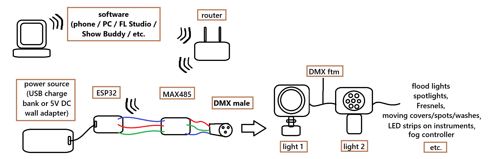
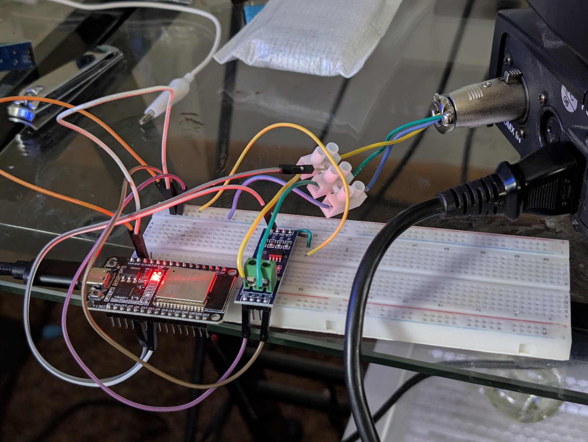
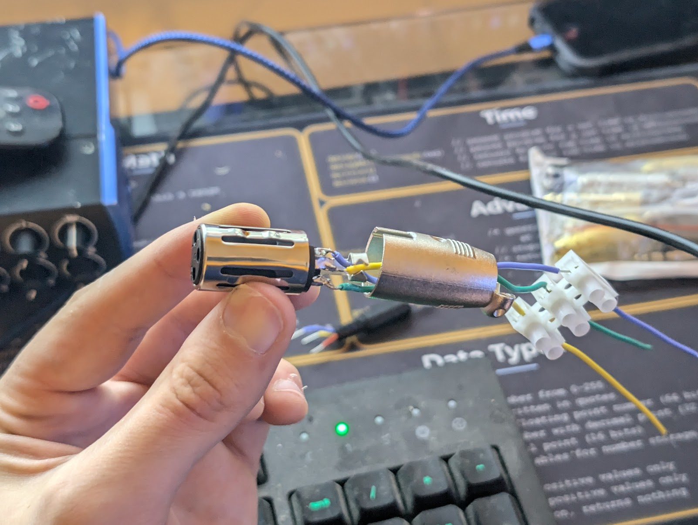
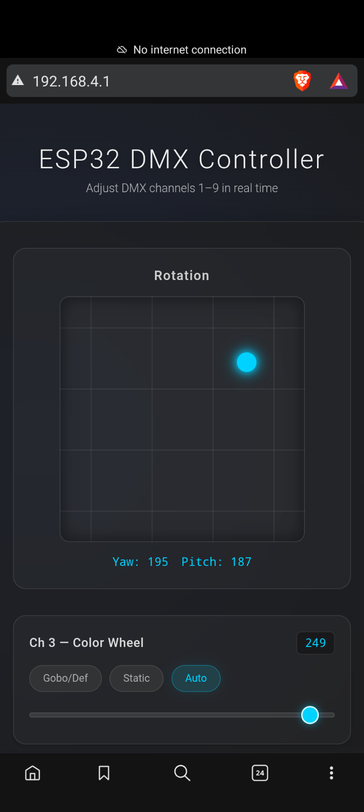
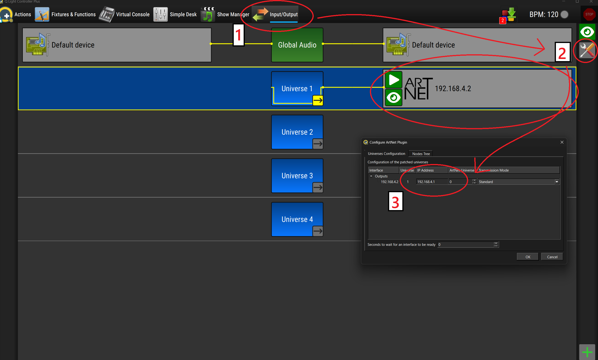
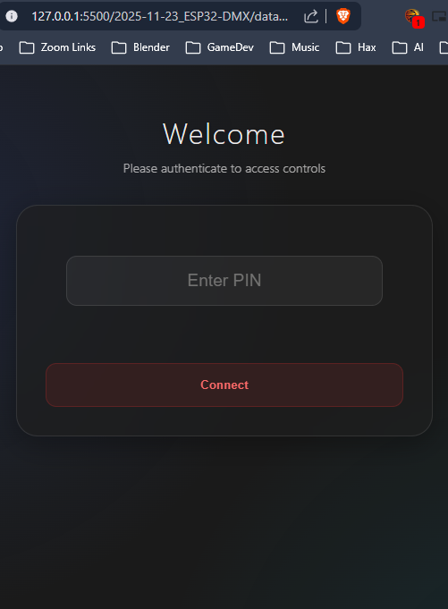
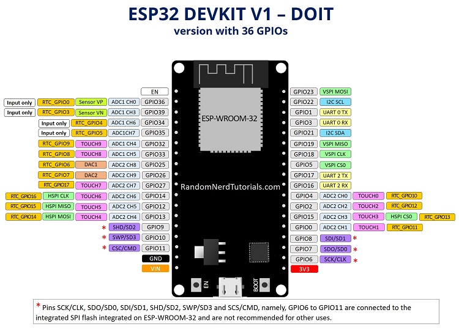
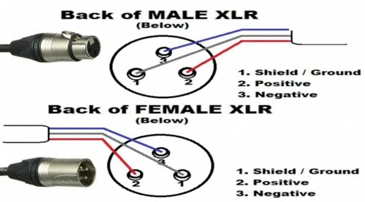

# ESP32 DMX Controller

## Overview

This project aims to use a basic ESP32 board to control multiple DMX lighting fixtures wirelessly through a web interface with inexpensive components (**Figure 1**).  Here, I use a moving head fixture for proof of concept (**Figure 2**).

- DMX uses a differential signaling method over RS485, so a MAX485 module is used to convert signals from the ESP32's UART pins to DMX-compatible signals (**Figure 3a**)

- These signals connect to a DMX fixture via a standard 3-pin XLR cable (**Figure 3b**)

- In addition to handling the DMX signal encoding, the ESP32 serves a web interface written in HTML/CSS/JS that allows the user to control DMX signal sends over WiFi from a mobile device or computer (**Figure 4**)

## **Fig. 1:** Overview Scheme



## **Fig. 2:** Proof of concept

An initial wiring of the circuit hard-coded with a basic loop incrementing the rotation and strobing the light on the ESP32 was used to see if DMX signals could be sent reliably prior to wireless control.  It is shown below:


## **Fig. 3:** Circuit

The schematic is best viewed on the GadgetReboot video this video was inspired by (timestamped [here](https://youtu.be/4PjBBBQB2m4?t=306)), but a static close-up of my circuit is shown below:



as well as close-up of the XLR wiring:



## **Fig. 4:** Mobile Web Interface

As a web interface, there is a ton of room for extensibility and customizability here.  I've chosen to use an XY pad for the first two channels, and sliders with radio buttons to translate their range through each discrete parameter setting, where applicable.  The current version is shown here:



as well as a proof of concept video: 


Bear in mind that for multiple fixtures, each will need its own DMX address set locally on that device (unless they are all intended to respond identically).  Up to 512 channels can be sent this way in a single DMX daisychained set (a "DMX universe").  So, for instance, 100 devices with 5 channels each could all receive unique instructions (though its unclear at what point the esp32's performance will become a bottleneck).

## **Fig. 5: wireless QLC+ settings and demo**

For any lighting system more complex than a single fixture with a routine more complex than 'on/off', a lighting control system is likely preferred over a simple web interface.  These software control systems can simplify virtually every aspect of DMX control.  In addition to providing a console interface for direct DMX channel control, they can:
 - host libraries of pre-programmed fixtures, with their DMX channel mappings and icons to visually separate channel types, like GOBO, movement, and color
 - illustrate an overhead view of the stage with the fixtures in their physical positions to simulate lighting and movement routines
 - save complex fixture orchestrations, consolidate them into single button presets, and automate the transition between them 
 - transmit DMX512 wirelessly from your device to a DMX receiver through the ArtNet protocol

The sketch has been configured to receive ArtNet DMX data from such software through the ESP32's WiFi interface over UDP (ArtNet port 6454):

```cpp
#include <WiFiUdp.h>

// Art-Net settings
WiFiUDP Udp;
const int ARTNET_PORT = 6454;
const int ARTNET_BUFFER_MAX = 530; // Header(18) + 512 channels
uint8_t packetBuffer[ARTNET_BUFFER_MAX];
```
A popular open source option for Windows/MacOS/Linux is QLC+.  The settings to facilitate ArtNet DMX data transmission in QLC+are shown below:



along with a short proof of concept video:


One of the IP assignments shown in the settings image may be unnecessary.  I'm not yet very familiar with the software, though I am impressed with its capabilities and relative ease of use.

## File system implementation

The most straightforward method for including the code to serve HTML content over a network is to just hardcode it as a string into the sketch.  Other than being inelegant, this also becomes inconvenient when you want to prototype and edit the HTML/CSS/JS files separately during development.  A solution to this is to include a filesystem.  

Though a filesystem is less trivial to manage than I anticipated, it has the added benefit of allowing a user to edit the storage on the ESP32's flash outside of sketch uploads, in theory allowing custom content/preferences generated during use to persist between sessions (though I have not yet found any preference that wouldn't be better left hard-coded for now).

The LittleFS library is used here. To use it, you will need to format the filesystem when uploading the code.  This can take various forms, but in Arduino IDE 2.x (different in 1.x), you can download the most recent littlefs .vsix release from [here](https://github.com/earlephilhower/arduino-littlefs-upload/releases), restart the IDE, quit the serial monitor if it's running, and then use the "Build LittleFS image in the sketch directory" and "Upload to LittleFS" commands in the command palette (Ctrl+Shift+P).  You'll see the added binary file `mklittlefs.bin` appear in the sketch directory if the build was successful, and the console will print a success message if the upload was successful.

Example:

```cpp
#include <LittleFS.h>

  // Serve index from file system
  File file = LittleFS.open("/index.html", "r");
  if (!file) {
    server.send(500, "text/plain", "Index missing");
    return;
  }
  server.streamFile(file, "text/html");
  file.close();
```

## **Fig. 6:** Captive Portal

In the most straightforward access point configuration, the user needs to manually navigate to the IP address (probably 192.168.4.1) in their web browser (I also found it necessary to disable my phone's mobile data to ensure it connected properly).

'Captive portals' can automatically redirect the user to the appropriate IP address upon connection.  The one implemented here is shown below:



This is done with the DNS and WebServer libraries:

```cpp
#include <DNSServer.h>
#include <WebServer.h>

// Captive Portal / Web Server
const byte DNS_PORT = 53;
DNSServer dnsServer;
WebServer server(80);
const char* LOGIN_PIN = "1234";
```

I am not sure the best way to manage security/authentication, but here an easy to remember (and guess) PIN is hard-coded into the sketch.  Presumably that will not be a problem for this device, but maybe I'll end up changing the PIN to a passphrase, hard-coding the phrase's hash, and adding a hashing algorithm for the user's input.

## Parts List

**Buy:**

- ESP32 Development Board - [$17 for a 5-pack at Amazon](https://www.amazon.com/5PCS-Development-LUIRSAY-Bluetooth-Support/dp/B0DZNHYDS8?sr=8-12) (sales timings fluctate)

- MAX485 Module - [$10 for a 10-pack at Amazon](https://www.amazon.com/ANMBEST-Transceiver-Arduino-Raspberry-Industrial-Control/dp/B088Q8TD4V?s=electronics&sr=1-2)

**Assumed on-hand:**

- USB-C Cable and Wall Adapter

- DMX Lighting Fixture(s) + XLR/DMX Cables (one cable for each fixture)

- Soldering Equipment and/or Jumper Wires + Breadboard

Miscellaneous items like heat shrink tubing, wire strippers, and screw terminals may also be useful

## Notes

- the current sketch uses the ESP32 as a direct access point rather than connecting both it and the controlling device to a shared network, though the real-world signal strength/integrity would presumably suffer without a dedicated router/switch

- Youtuber Gadget Reboot seemed to experience no difficulties bitbanging his Arduino's GPIO pins directly into the MAX485 without a UART like the ESP32 has, but presumably that method would prove less consistent in a project where the CPU was having to deal with WiFi components or otherwise deviating from the strict timing requirements of DMX and using more complex fixtures like moving heads where imprecise timings may result in more obvious jerky motion.

- the original ChatGPT sketch used the D4 GPIO pin to selectively pull the TX/RX pins high for control over transmission direction, but I didn't understand why that would be helpful and so hardwired them both to VCC which corresponds to a permanent transmission-enable / receive-disable.

- the DMX standard insists on 5-pin XLR connectors to avoid possible confusion with audio XLR cables, particularly ones carrying phantom power which may damage the fixtures, but 3-pin XLR is the "de facto" standard

  - Similarly, XLR and proper DMX cables differ somewhat in electrical characteristics, but most DMX fixtures seem tolerant of this to the best of my understanding

- Which of the a/b pair coming from the MAX485 connects to hot/cold on the XLR seems opposite in practice from what I read in the fixture's manual, though it did suggest that the polarity is different in some fixtures.  I'm not yet sure if this will influence downstream fixtures in a daisy-chain, though I suspect it will not

## Compare to existing options

- $17 DMX Shield for Arduino Uno by CQRobot - [amazon](https://www.amazon.com/CQRobot-network-Management-Extended-Functions/dp/B01DUHZAT0?sr=8-1)

  - I'm only discovering these 'shield' options after I finished the project and they both seem viable.  
  
  - Here, the reviews seem positive and it certainly would save the hassle of manual wiring.  The drawbacks are that even generic Uno boards are more expensive and less powerful than ESP32s, and they do not support wireless connectivity  

- $18 DMX Shield for ESP32 by SparkFun ([video demo](https://youtu.be/WCxcUrVRrqg)) - [sparkfun store](https://www.sparkfun.com/sparkfun-esp32-thing-plus-dmx-to-led-shield.html)

  - This option may actually blow my project out of the water for minimizing beginner friction while maintaining high customizability at a relatively low cost.  You have to purchase the ESP32 separately, but not only do you get the RS485 transceiver and DMX in/out, but there's a set of poke-home terminals for addressable RGB LED strips, ground loop isolation, and opto-electronic isolation. 
    
  - The [sketch in their repo](https://github.com/sparkfun/SparkFunDMX/blob/master/examples/Example4-ArtnetOutput/Example4-ArtnetOutput.ino) also supports Art-Net (DMX over IP) which is less direct than my method, but makes more sense for the software that will probably be ideal for sending complex DMX routines.  An anonymous reviewer who was happy with their purchase also recommends "using the newer hideakitai/ArtNet library with the SparkFunDMX library to make your own Art-Net node, as it supports ArtPoll and ArtPollReply, very important for Art-Net lighting software compatibility (such as Lightkey)"
    
  - Sparkfun suggests the shield be paired with their "ESP32-Thing Plus" board (additional $25), but a reviewer on the product page notes that an ordinary ESP32-S2 WROOM worked fine for them (also that they had to swap which i2c bus the shield used?  I wish they elaborated more on that)

- $67 USB (wired) DMX512 interface by Entecc ("Entry level model" in their words) - [amazon](https://www.amazon.com/Open-DMX-USB-Interface-Controller/dp/B00O9RY664?sr=8-4)

- $80 WiFi (wireless) DMX controller by Pknight - [amazon](https://www.amazon.com/Pknight-Controller-Transceiver-Connectivity-EN-3P/dp/B091DS89M4?sr=8-5)

## to-do

- [ ] Test with a multi-fixture universe

- [ ] Implement proper fixture routines through QLC+

-  Misc. quality of life and troubleshooting
    - [ ] handle disconnects gracefully
    - [ ] think on better initial states for channels (master dimmer maybe at 50%?)
    - [x] automatically direct AP connection to the appropriate IP
    - [x] blink on-board LED when sending DMX data
    - [x] persistent variables with a preferences or filesystem library

- [x] Migrate embedded HTML to a LittleFS filesystem for more modularity and ease of updating

- [x] Implement WIFI connectivity for remote control (get the interface to relay DMX commands successfully)

- [x] Create basic web interface for controlling DMX fixtures

- [x] Proof-of-concept automated fixture routine

- [x] Wire up basic circuit on breadboard

## More considerations

- connecting a second ESP32 to a MIDI foot controller to trigger DMX scenes for live performance control where the web interface is impractical

- adding a button to the web interface to trigger a routine

- adding a button to the web interface to swap to a simple page with like 100 simple, numbered sliders for generic channel control
    
    - maybe a script to highlight each one in turn and slide it up and down to track unknown fixture parameters 

- enclosure design, strain relief, and power supply options

- documenting and optimizing for latency and reliability over realistic cable lengths

- ESP32's 4 MB of flash is almost certainly overkill for this project...I wonder what sort of complexity requires an SD module in some people's projects?

- migrating to platform.io vs Arduino IDE for easier dependency management and version control

- what could even be in the USB-to-DMX adapters on the market that make them so expensive (~$70 for the barebones open source Enttec)?

- non-traditional performance control, like video -> LED array on an instrument ([demo video](https://youtu.be/hCFKy4J_xGY) and [guide](https://learn.sparkfun.com/tutorials/using-artnet-dmx-and-the-esp32-to-drive-pixels))

## Resources

- **Gadget Reboot's Arduino-to-DMX Tutorial** [youtube video](https://www.youtube.com/watch?v=4PjBBBQB2m4&pp=ygUZZ2FkZ2V0IHJlYm9vdCBhcmR1aW5vIGRteNgGMg%3D%3D)

- **DMX512 Protocol** [wikipedia article](https://en.wikipedia.org/wiki/DMX512)

- **ZQ02001 25W Moving Head DJ Lights** [manual](https://manuals.plus/uking-2/uking-zq02001-25w-moving-head-dj-lights-user-instructions#dmx_addressing) (used in proof of concept)

- **ESP32 Web Server Tutorial** [randomnerdtutorials](https://randomnerdtutorials.com/esp32-web-server-beginners-guide/)

### **Fig. s1:** ESP32 Pinout



### **Fig. s2:** XLR Wiring

